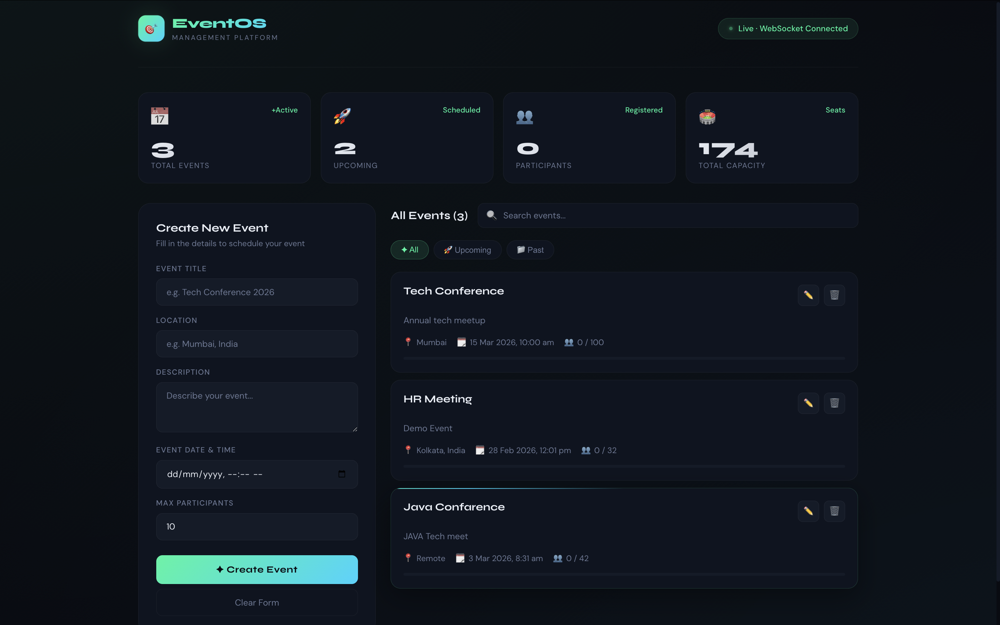

<div align="center">

<!-- ANIMATED HEADER -->


<!-- TYPING ANIMATION -->


<br/>

<!-- ANIMATED BADGES -->
<p>
  
  
  
  
</p>

</div>

---

##  Tech Stack

<div align="center">

<table>
<tr>
  <td align="center" width="130">
    <br/>
    <sub><b>Spring Boot</b></sub>
  </td>
  <td align="center" width="130">
    <br/>
    <sub><b>React</b></sub>
  </td>
  <td align="center" width="130">
    <br/>
    <sub><b>PostgreSQL</b></sub>
  </td>
  <td align="center" width="130">
    <br/>
    <sub><b>Docker</b></sub>
  </td>
  <td align="center" width="130">
    <br/>
    <sub><b>Maven</b></sub>
  </td>
  <td align="center" width="130">
    <br/>
    <sub><b>Java 17</b></sub>
  </td>
</tr>
</table>

<br/>


</div>

---

## 🚀 Project Overview

> **EventOS** is a **production-grade full-stack Event Management Platform** engineered for performance, real-time responsiveness, and clean architecture — built to demonstrate enterprise-level engineering patterns.

<div align="center">

| 🎯 Feature | 💡 Tech Used | ✅ Status |
|:---|:---|:---:|
| REST API Architecture | Spring Boot MVC | ✅ Done |
| Real-Time Updates | WebSockets (STOMP) | ✅ Done |
| Secure Endpoints | Spring Security | ✅ Done |
| Frontend Integration | React + Axios | ✅ Done |
| Containerization | Docker | ✅ Done |
| Database ORM | Spring Data JPA | ✅ Done |

</div>

---

## 🌐 Web Interface

<div align="center">
  
</div>

---

## 📊 Live Dashboard

<div align="center">
  
</div>

---

## 🏗️ System Architecture

```
┌─────────────────────────────────────────────────────────┐
│                   🌐 React Frontend                      │
│              (UI Layer — Axios + STOMP Client)           │
└────────────────────┬──────────────┬─────────────────────┘
                     │              │
              REST (Axios)    WebSocket (STOMP)
                     │              │
                     ▼              ▼
┌─────────────────────────────────────────────────────────┐
│              🟢 Spring Boot Backend                      │
│  ┌──────────────────────────────────────────────────┐   │
│  │         Controller Layer  (REST + WS)             │   │
│  └──────────────────────┬───────────────────────────┘   │
│                         ▼                                │
│  ┌──────────────────────────────────────────────────┐   │
│  │              Service Layer (Business Logic)       │   │
│  └──────────────────────┬───────────────────────────┘   │
│                         ▼                                │
│  ┌──────────────────────────────────────────────────┐   │
│  │         Repository Layer (Spring Data JPA)        │   │
│  └──────────────────────┬───────────────────────────┘   │
└───────────────────────────────────────────────────── ───┘
                          │
                          ▼
            ┌─────────────────────────┐
            │   🐘 PostgreSQL Database │
            └─────────────────────────┘
```

---

## 🔐 Security Layer

<div align="center">

```
🔒 Spring Security Configuration
┌─────────────────────────────────────────────┐
│  ✅ Basic Authentication (HTTP)              │
│  ✅ Secured REST Endpoints                   │
│  ✅ CORS Configuration                       │
│  🔜 Extendable to JWT                       │
│  🔜 Role-Based Access Control (RBAC)        │
└─────────────────────────────────────────────┘
```

</div>

---

## ✨ Core Features

<div align="center">

```
╔══════════════════════════════════════════════╗
║            🌟 EventOS Features               ║
╠══════════════════════════════════════════════╣
║  📝  Create / Update / Delete Events         ║
║  ⚡  Real-Time Dashboard via WebSockets      ║
║  🔍  Search & Filter Events                  ║
║  🟢  Live WebSocket Connection Status        ║
║  🏛️  Clean MVC Layered Architecture         ║
║  🐳  Docker Ready for Production             ║
╚══════════════════════════════════════════════╝
```

</div>

---

## 🐳 Docker Support

<details>
<summary><b>📦 Click to expand Docker setup</b></summary>

<br/>

**Dockerfile:**
```dockerfile
FROM eclipse-temurin:17
COPY target/*.jar app.jar
ENTRYPOINT ["java", "-jar", "/app.jar"]
```

**Build & Run:**
```bash
# Build the image
docker build -t eventos-backend .

# Run the container
docker run -p 8095:8095 eventos-backend
```

</details>

---

## 🌍 Deployment Guide

<details>
<summary><b>🚀 Render Deployment</b></summary>

```
1. Connect GitHub repository to Render
2. Build Command:  ./mvnw clean install
3. Start Command:  java -jar target/*.jar
4. Set environment variables
5. Deploy 🎉
```

</details>

<details>
<summary><b>🚂 Railway Deployment</b></summary>

```
1. Create new Railway project
2. Connect GitHub repository
3. Add PostgreSQL plugin
4. Set environment variables
5. Deploy automatically 🎉
```

</details>

<details>
<summary><b>☁️ AWS EC2 Deployment</b></summary>

```bash
# 1. Launch EC2 instance (Ubuntu recommended)
# 2. Install dependencies
sudo apt update && sudo apt install openjdk-17-jdk maven git -y

# 3. Clone & Run
git clone <your-repo-url>
cd event-management
./mvnw spring-boot:run

# 4. Open port 8095 in Security Group ✅
```

</details>

---

## 📁 Project Structure

```
event-management/
│
├── 📂 src/
│   ├── 📂 main/
│   │   ├── 📂 java/
│   │   │   └── 📂 com/eventos/
│   │   │       ├── 📂 controller/     # REST + WebSocket Controllers
│   │   │       ├── 📂 service/        # Business Logic Layer
│   │   │       ├── 📂 repository/     # Spring Data JPA Repos
│   │   │       ├── 📂 model/          # JPA Entity Classes
│   │   │       └── 📂 config/         # Security & WS Config
│   │   └── 📂 resources/
│   │       └── application.properties
│   └── 📂 test/
│
├── 📂 event-frontend/                  # React Frontend
│   ├── 📂 src/
│   │   ├── 📂 components/
│   │   ├── 📂 pages/
│   │   └── 📂 services/               # Axios API Calls
│   └── package.json
│
├── 📂 Image/                           # Screenshots
├── 🐳 Dockerfile
└── 📄 pom.xml
```

---

## 📈 Learning Outcomes

<div align="center">

| 🎓 Concept | 📌 Applied In |
|:---|:---|
| Real-Time System Design | WebSocket (STOMP) Integration |
| REST API Best Practices | Spring MVC Controller Layer |
| Backend Security Fundamentals | Spring Security with Basic Auth |
| Docker Containerization | Dockerfile + Docker Compose |
| Frontend-Backend Integration | React + Axios + WebSocket Client |
| Production Deployment Workflow | Render / Railway / AWS EC2 |

</div>

---

## 🚀 Future Improvements

- [ ] 🔐 **JWT Authentication** — Stateless token-based auth
- [ ] 👥 **Role-Based Access Control** — Admin / User roles
- [ ] ⚡ **Redis Caching** — Faster data retrieval
- [ ] 🔄 **CI/CD Pipeline** — GitHub Actions automation
- [ ] 📊 **Analytics Dashboard** — Event statistics & charts
- [ ] 📱 **Mobile Responsive UI** — Full PWA support

---

## 👨‍💻 Developed By

<div align="center">


<br/>

### **Somnath Rana**
#### Full Stack Backend Engineer


<br/>

[](https://www.linkedin.com/in/somnath7/)
[](https://github.com/somnathrana)

<br/>

<a href="https://www.linkedin.com/in/somnath7/" target="_blank">
  
</a>

</div>

---

<div align="center">


**⭐ If you found this project helpful, please give it a star!**


</div>
